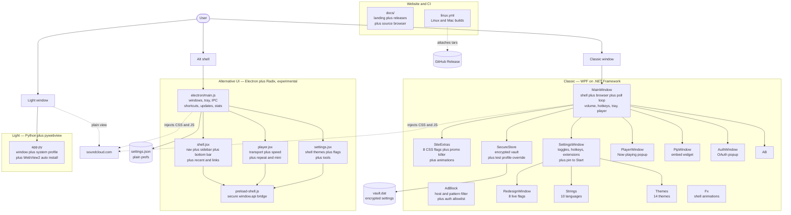

# SoundCloud Desktop

**The most lightweight unofficial SoundCloud client. About 3 MB, no installer, no services, no telemetry.**

> Fan project, not affiliated with SoundCloud. All music, the name and the logo belong to SoundCloud and its artists.

[Download](#download) - [Builds](#builds) - [Screenshots](#screenshots) - [Features](#features) - [Platforms](#platforms) - [Build](#build) - [Source map](#source-map) - [FAQ](#faq)

## Download

Grab the latest release on the [Releases page](https://github.com/ToraScriptCopy/soundcloud-desktop/releases). Everything is portable: unpack and run, no install, no admin rights.

| Build | Windows x64 | Windows x86 | Linux x64 | macOS | Size |
|---|---|---|---|---|---|
| **Classic** (WPF) | `...-Portable-vX.zip` | - | - | - | ~3 MB |
| **Alternative UI** (Electron + Radix, experimental) | `...-AlternativeUI-vX.zip` | - | `...-Linux-AlternativeUI-vX.tar.gz` | `...-Mac-AlternativeUI-{arch}-vX.tar.gz` | ~160 MB |
| **Light** (single file) | `SoundCloudLight.exe` | `SoundCloudLight-x86.exe` | `SoundCloudLight-Linux-vX.tar.gz` | `SoundCloudLight-Mac-{arch}-vX.tar.gz` | ~100 MB |

The Classic build needs [WebView2 Runtime](https://go.microsoft.com/fwlink/p/?LinkId=2124703). Win10 and Win11 usually have it already. Light installs it for you when it is missing. Alt needs nothing extra on Windows. On Linux, Alt needs basic desktop libs (`libnss3`, `libatk`, `libcups`), Light needs WebKitGTK (`libwebkit2gtk-4.1-0`). Mac builds are unsigned, right-click the app and choose Open on first launch.

- **Classic (WPF)** - the main build. Fluent shell, Now playing popup, PiP player, hotkeys, extensions, 14 themes, encrypted local settings.
- **Alternative UI** - the experimental playground. Real Radix Themes interface with a full shell (navigation, sidebar, bottom bar) plus 20 extra desktop features. Bigger download, needs no WebView2.
- **Light** - one exe and nothing else, just SoundCloud in a window titled SoundCloud Light. Login lives in system files, the folder stays clean. Installs WebView2 itself when it is missing.

## Screenshots

Real windows captured from running builds.

| Classic | Alternative UI |
|---|---|
|  |  |

<strong>All 20 Alt extras (click to expand)</strong>

1. Jump List with recently played tracks
2. Mini player mode (compact always-on-top)
3. Sleep timer (15/30/60/90 min)
4. Playback speed (0.75x to 2x)
5. Repeat one
6. Like button in shell and player
7. Track-change desktop notifications
8. Tray tooltip with the current track
9. Page zoom (Ctrl + / - / 0)
10. Recently played list in the sidebar
11. Quick links (saved pages in the sidebar)
12. Start minimized
13. Boss key (F9 hides everything)
14. Always on top
15. Shell themes (dark / light / system, 6 accents)
16. Adblock blocked-counter
17. Listening stats (tracks + time)
18. Built-in update checker
19. Settings export and import
20. Playback progress bar in the bottom bar

## Features

- **Login sticks.** Google, Apple or password. Restart, still signed in.
- **Now playing popup.** Cover art, artist, controls, minimize to tray.
- **PiP widget.** Any track or playlist in an always-on-top window.
- **ReDesign with flags.** Every part of the site restyled separately: cards, buttons, header, bottom player, comments, sidebar, inputs, popups. Text colors stay as they are.
- **Promo killer.** Become-an-author banners removed by their root container, always, without touching login or signup.
- **Site animations.** Simple fades and pops for cards, modals and menus.
- **Extensions.** Unpacked Chrome extensions from a folder.
- **Quiet adblock.** Off by default, never touches login windows.
- **Hotkeys.** Numpad controls that work even unfocused.
- **Tray, autostart, sidebar, volume that actually saves.**

## Why it runs lighter than the rest

- **Tiny.** Classic is about 3 MB. Electron based clients bundle a full browser and idle at 100+ MB of RAM. Here the browser (WebView2) is shared with the system, so the app itself adds almost nothing.
- **No installer, no services.** Nothing runs when the app is closed, unless you turn on autostart yourself.
- **One browser profile.** Login stored once and reused, minimal flags, fast start.
- **No tracking.** Settings live locally encrypted, only for your Windows user.

## Platforms

| Build | Windows x64 | Windows x86 | Linux x64 | macOS x64 and arm64 |
|---|---|---|---|---|
| Classic (WPF) | Yes | No | No, WPF is Windows-only | No, WPF is Windows-only |
| Alternative UI | Yes | No | Yes, portable tar | Yes, app tar via CI |
| Light | Yes, single exe | Yes, single exe | Yes, portable tar | Yes, binary tar via CI |

Linux and Mac builds are produced automatically by CI on every release. Classic cannot leave Windows: WPF only exists there. Mac builds are unsigned, right-click the app and choose Open on first launch.

## Source map

How the program works, file by file.

**WpfApp1/ - the Classic build (C#, WPF, .NET Framework 4.8)**

| File | Responsibility |
|---|---|
| `MainWindow.xaml` / `.xaml.cs` | Main window: top nav bar, sidebar, site view, bottom volume bar. Owns the WebView2 browser, the poll loop (track info), volume, hotkeys, tray icon, PiP and player windows, extension loading. Entry point of the whole app. |
| `AdBlock.cs` | Host + pattern request blocker with an auth allowlist. Single toggle, off by default, login windows are never blocked. |
| `SiteExtras.cs` | Everything injected into soundcloud.com: ReDesign CSS split into 8 flags (cards, buttons, header, player, comments, sidebar, inputs, popups), site animations, thin scrollbars, and the promo killer script. |
| `SecureStore.cs` | Settings vault: JSON + SHA256 hash, DPAPI-encrypted per Windows user. Holds `AppState` with all toggles, volume, hotkeys, flags, extension folders. `SCD_PROFILE` env override for isolated test runs. |
| `SettingsWindow.xaml` / `.xaml.cs` | Settings: language, theme, toggles, hotkey binds, extensions list, cache clear, reset, button into the ReDesign window. |
| `RedesignWindow.xaml` / `.xaml.cs` | The 8 ReDesign flag toggles, applied live to the site. |
| `PlayerWindow.xaml` / `.xaml.cs` | The Now playing popup: artwork, title, artist, time, transport buttons, PiP, minimize to tray. |
| `PipWindow.xaml` / `.xaml.cs` | Always-on-top widget with the SoundCloud embed player for any link. |
| `AuthWindow.xaml` / `.xaml.cs` | Popup window for login flows (Google, Apple). Shares the main browser profile, so login lands in the app. |
| `Strings.cs` | All UI text in 10 languages with auto-detect. |
| `Themes.cs` | 14 Fluent themes (system, dark, light + accent colors). |
| `Fx.cs` | Shell animation helpers: fades, slides, window entrances. Only opacity and transforms, WebView2 is never animated. |
| `App.xaml` / `.xaml.cs` | App bootstrap, global resources, subtle slider and scrollbar styles, crash log. |
| `Icons.xaml` | Hand-drawn icon geometries for shell buttons. |
| `WpfApp1.csproj` | Project file: net48, x64, WPF-UI + WebView2 packages. |

**AltElectron/ - the experimental build (Electron + React + Radix Themes)**

| File | Responsibility |
|---|---|
| `electron/main.js` | Everything behind the windows: windows, tray, Jump List, shortcuts, adblock, extensions, update checker, stats, sleep timer, IPC, settings store. Mirrors the WPF site CSS/JS. |
| `electron/preload-shell.js` | Secure bridge between React windows and the main process (`window.api`). |
| `src/shell.jsx` | Main window UI: top nav bar, sidebar (nav, PiP, recent, quick links), bottom bar with progress, volume, like. |
| `src/player.jsx` | Now playing window: artwork, transport, speed, repeat, like, mini mode, volume. |
| `src/settings.jsx` | Settings window: shell themes, playback, blocking, ReDesign flags, stats, extensions, updates, data tools. |
| `src/shell.css` | Shell animations, thin scrollbars, subtle sliders, artwork rounding. |
| `scripts/pack-portable.js` | Assembles the portable folder from the Electron runtime + app files. Works for Windows and Linux targets. |
| `vite.config.js`, `player.html`, `settings.html`, `shell.html` | Vite multi-page build for the three React windows. |

**Light/ - the single-file build (Python + pywebview)**

| File | Responsibility |
|---|---|
| `app.py` | The whole app: window with soundcloud.com, profile in system files, anti-throttle flags for smooth background playback, one-click WebView2 install when missing. Builds to one exe with PyInstaller (x64 and x86). |
| `ul-icon.ico` | App icon embedded into the exe. |

**docs/ - the website (static, GitHub Pages)**

| File | Responsibility |
|---|---|
| `index.html` | Landing: builds, screenshots, features, platforms, live releases, source browser, verification, FAQ. |
| `styles.css` | Material 3 dark baseline (light theme included), reveal animations, responsive layout. |
| `i18n.js` | All 10 interface languages with flag picker, choice remembered. |
| `site.js` | Live GitHub data (releases, file tree, hashes), theme toggle, copy buttons, fullscreen editor. |
| `sitemap.xml` + `sitemap-*.xml`, `robots.txt` | Search engine index with hidden sitemaps. |
| `screenshots/` | Real captures from running builds. |

**.github/workflows/linux.yml** - CI: builds the Linux Alt tar and Light binary on every release and attaches them automatically.

## FAQ

Is this official?

No. Fan project, not affiliated with SoundCloud.

Where is my login stored?

In system files, never next to the exe. Classic uses LocalAppData, Alt uses its Electron profile, Light uses its own LocalAppData folder (XDG data dir on Linux).

Something broke after a SoundCloud update?

Playback and login are the real site inside the app. If SoundCloud changes its layout, open an issue.

## License

MIT. See [LICENSE](https://github.com/ToraScriptCopy/soundcloud-desktop/blob/main/LICENSE).
